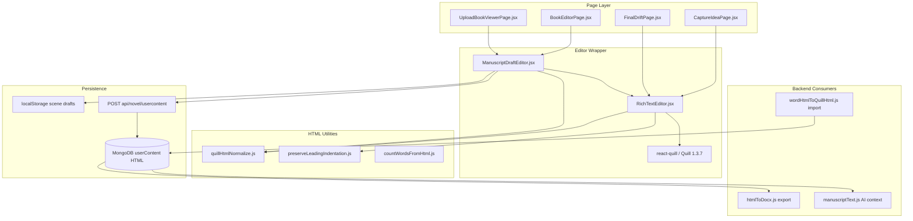

# Quill Editor Migration Impact Report

**Status:** Baseline for editor replacement planning  
**Date:** 2026-09-01  
**Scope:** `BookEditorPage.jsx`, `UploadBookViewerPage.jsx`, and all Quill-related dependencies across the Story Groove codebase  
**Audience:** Engineering team  

---

## Table of Contents

1. [Executive Summary](#1-executive-summary)
2. [Current Architecture](#2-current-architecture)
3. [BookEditorPage Analysis](#3-bookeditorpage-analysis)
4. [UploadBookViewerPage Analysis](#4-uploadbookviewerpage-analysis)
5. [Side-by-Side Comparison](#5-side-by-side-comparison)
6. [Current Quill Implementation (RichTextEditor)](#6-current-quill-implementation-richtexteditor)
7. [Feature Inventory](#7-feature-inventory)
8. [Content / Data Flow](#8-content--data-flow)
9. [Quill Dependencies Across the Codebase](#9-quill-dependencies-across-the-codebase)
10. [CSS / UI Dependencies](#10-css--ui-dependencies)
11. [Hidden / Indirect Dependencies](#11-hidden--indirect-dependencies)
12. [Technical Debt / Existing Issues](#12-technical-debt--existing-issues)
13. [Migration Risk Matrix](#13-migration-risk-matrix)
14. [Replacement Editor Requirements](#14-replacement-editor-requirements)
15. [Data Migration Strategy](#15-data-migration-strategy)
16. [Testing & Regression Plan](#16-testing--regression-plan)
17. [Final Migration Checklist](#17-final-migration-checklist)
18. [Files / Components Likely Needing Changes](#18-files--components-likely-needing-changes)
19. [Uncertainties / Manual Validation Needed](#19-uncertainties--manual-validation-needed)

---

## 1. Executive Summary

Both `BookEditorPage.jsx` and `UploadBookViewerPage.jsx` are **consumers** of a shared editor stack — they do **not** embed Quill directly. The actual editor lives in:

```
ManuscriptDraftEditor → RichTextEditor → react-quill (Quill 1.3.7)
```

**Packages:** `react-quill@^2.0.0` → `quill@^1.3.7` (from `package-lock.json`).

**Persisted format:** HTML strings in MongoDB `UserContent.userContent` — **not** Quill Delta JSON. The backend stores and returns opaque HTML with no schema validation.

**Migration complexity: HIGH.** Story Groove has built substantial manuscript-specific behavior on top of Quill: blank-line round-tripping, Word-style first-line indent (via `&nbsp;`), custom block formats (`lineHeight`, `paragraphSpacing`), Word paste normalization, a custom spellcheck overlay tied to Quill's index/bounds APIs, voice dictation with live cursor rebasing, and export pipelines that expect Quill-generated markup (`ql-align-*`, inline `font-size`/`line-height`/`margin-bottom`).

**Critical risk:** Formatting loss for existing user manuscripts if the replacement editor does not preserve the same HTML semantics or if stored HTML is re-normalized on load.

**Good news:** Page-level code (`BookEditorPage`, `UploadBookViewerPage`) talks to the editor through a **ref-based HTML API** (`getHtml`, `setHtml`, `saveNow`, dictation methods, `undo`/`redo`) via `ManuscriptDraftEditor`. Replacing Quill inside `RichTextEditor` while preserving that imperative surface would minimize page-level churn.

---

## 2. Current Architecture



### Key entry points

| Layer | File |
|-------|------|
| Book editor page | `storygroove-fe/src/Pages/BookEditor/BookEditorPage.jsx` |
| Upload / Ellis viewer page | `storygroove-fe/src/Pages/UploadedManuscript/UploadBookViewerPage.jsx` |
| Draft wrapper (autosave, dirty state) | `storygroove-fe/src/component/manuscriptEditor/ManuscriptDraftEditor.jsx` |
| Quill implementation | `storygroove-fe/src/component/richTextEditor/RichTextEditor.jsx` |

---

## 3. BookEditorPage Analysis

**File:** `storygroove-fe/src/Pages/BookEditor/BookEditorPage.jsx` (~3,950 lines)

### Role

Primary novel drafting UI (Olivia Scene Coach). Uses `ManuscriptDraftEditor` at lines ~3666–3698.

### Editor integration (not Quill-direct)

| Concern | Implementation |
|--------|----------------|
| Ref | `manuscriptDraftRef` |
| Live HTML | `getLiveDraftHtml()` → `manuscriptDraftRef.current?.getHtml?.()` |
| Save | `updateUserContent({ id, userContent })` via `saveUserContent` / `handleDraftAutosave` |
| Dirty check | `areQuillHtmlEquivalent(html, savedHtml)` |
| Scene switch | Flushes dirty draft to localStorage + server before switching (`handleSelectSceneFromOutline`, ~3217–3281) |
| Autosave debounce | 800ms (`DRAFT_AUTOSAVE_DEBOUNCE_MS`) in `ManuscriptDraftEditor` |
| Local draft recovery | `resolveDraftForScene` / `writeSceneDraft` / `clearSceneDraft` |
| Undo/redo UI | `EditorHistoryControls` → ref `undo()` / `redo()` |
| Voice typing | `useEditorDictation({ richEditorRef: manuscriptDraftRef })` + `VoiceRecorder` |
| Read-only | `shouldBeReadOnly = isViewMode \|\| bookData?.status === "completed"` → `readOnly` prop |
| Pre-outline gate | Hides editor when no scenes ready (`showEditorEmptyState`, ~3101–3112) |
| Offline | Defers server save, shows "Saved on device" badge, syncs on `online` event |
| Word count | `debouncedLiveHtml` (300ms) → `countSceneManuscriptWords` |
| Olivia integration | `saveImmediately()` before chat sends so DB has latest HTML (~2948, ~2968) |
| Bootstrap HTML | `preserveLeadingIndentation(resolved.text)` — no uploaded-manuscript stripping |

### Content loading flow

1. `getABook` → `userContents[].userContent` (HTML)
2. `resolveDraftForScene(novelId, sceneId, serverContent)` — prefers localStorage if diverged
3. `manuscriptEditorBootstrap.initialHtml` seeds editor once per scene (`key={selectedScene.id}`)
4. `ManuscriptDraftEditor` sets local `html` state; `RichTextEditor` silently loads via `quill.setContents(clipboard.convert(html))`

### Notable absence

**No cross-tab/device sync** on focus/visibility (unlike Upload viewer). BookEditor relies on localStorage recovery + online reconnect.

---

## 4. UploadBookViewerPage Analysis

**File:** `storygroove-fe/src/Pages/UploadedManuscript/UploadBookViewerPage.jsx` (~2,790 lines)

### Role

Ellis manuscript revision hub. **Fully editable** — not a read-only viewer despite the name.

### Same stack as BookEditor

Uses `ManuscriptDraftEditor` at lines ~2597–2625 with identical ref API.

### Upload-specific behavior

| Feature | Where | Details |
|--------|-------|---------|
| Display HTML stripping | `stripChapterHtmlForDisplay` (~198–208) | For uploaded books: `stripUploadedManuscriptDisplayHtml` removes scene titles / break ornaments; `preserveBlankParagraphs: true` |
| Chapter first line | `extractChapterFirstLine` (~131–138) | Strips HTML for outline metadata |
| Ellis empty-chapter check | `chapterHasEllisDraftContent` in `ellisChatHelpers.js` | Plain-text strip of HTML |
| Cross-device sync | `syncOnFocus` (~784–823) | On tab focus: flush dirty → refetch book → `applyServerContentIfClean` → `setHtml` if clean |
| Editorial letter gate | Ellis chat locked until letter saved | |
| Chapter delete/rename | Upload-specific outline handlers | |

### Content format

Same as BookEditor: HTML in `userContent`. Upload path adds **display-time transforms** before editor load; saved content goes through `preserveLeadingIndentation` without re-stripping titles (titles stripped only on load from server).

---

## 5. Side-by-Side Comparison

| Aspect | BookEditorPage | UploadBookViewerPage |
|--------|----------------|----------------------|
| Editor component | `ManuscriptDraftEditor` | `ManuscriptDraftEditor` |
| Quill usage | Indirect (shared) | Indirect (shared) |
| Editable | Yes (unless completed/view mode) | Yes |
| Read-only mode | Completed books / view mode | No |
| HTML pre-load transform | `preserveLeadingIndentation` only | + `stripUploadedManuscriptDisplayHtml` |
| Autosave | 800ms debounce | 800ms debounce |
| Offline handling | Yes (badge, deferred save) | No explicit offline mode |
| Cross-device sync | No | Yes (focus/visibility) |
| AI coach | Olivia | Ellis |
| Pre-save before AI | `saveImmediately()` | `saveImmediately()` |
| Empty editor gate | Pre-outline / no scene | Book loading only |
| Word count | `countSceneManuscriptWords` | `countChapterWords` (+ upload stripping rules) |
| Placeholder | "Start writing your chapter here." | "Start revising your chapter here." |
| Toolbar/history/voice | Same chrome pattern | Same chrome pattern |

**Conclusion:** One Quill implementation, two page shells with different manuscript metadata and sync policies.

---

## 6. Current Quill Implementation (RichTextEditor)

**File:** `storygroove-fe/src/component/richTextEditor/RichTextEditor.jsx` (~1,200 lines)

### Initialization

- `ReactQuill` with `theme="snow"`, `ref={quillRef}`
- Custom formats registered at module load via `Quill.register`
- Post-mount init in `useEffect` (~877–1134): toolbar labels, scroll binding, event listeners

### Configuration summary

| Setting | Value |
|---------|-------|
| Theme | `snow` |
| History | `{ delay: 1000, maxStack: 100, userOnly: true }` |
| Clipboard | `{ matchVisual: false, matchers: CLIPBOARD_MATCHERS }` |
| Read-only modules | `toolbar: false`, same clipboard matchers |

### Toolbar (`TOOLBAR_CONTAINER`, ~445–456)

Headers 1–3, bold/italic/underline/strike, highlight (background palette), align, font (Times New Roman / Arial), size (pt + legacy px), line spacing, paragraph spacing, ordered/bullet lists, link.

**Not in toolbar:** text color, images, video, blockquote, code block, horizontal rule, indent buttons (indent is Tab-based).

### Custom formats (Parchment)

- `lineHeight` — style attributor on `line-height` (1, 1.15, 1.5, 2)
- `paragraphSpacing` — style attributor on `margin-bottom` (0, 6pt, 12pt, 18pt + legacy em)
- `manuscriptFirstLineIndent` — block attribute `data-manuscript-first-line-indent`
- `font` whitelist: `times-new-roman`, `arial`
- `size` whitelist: pt sizes + legacy px sizes

### Custom keyboard bindings (~487–577)

- **Tab:** insert 5 nbsps (manuscript indent) on non-list lines
- **Shift+Tab:** remove leading nbsps/spaces
- **Enter:** continue first-line indent on new paragraph (via `scheduleIndentAfterNativeEnter`)

### Custom clipboard matchers (~427–431)

1. `matchWordFirstLineIndent` — tabs/CSS indent → nbsps
2. `matchWordFakeEmphasis` — strip Word fake bold/italic
3. `matchEmptyLine` — preserve `<p></p>` blank paragraphs

### Custom paste handler (~886–921)

Capture-phase listener on `quill.root`: if Word indent detected, preventDefault, run `preserveLeadingIndentation` + `clipboard.convert` + `updateContents`.

### Events

- `text-change` — emit HTML (user source only in `handleChange`), history state, spellcheck sync, dictation rebase
- `selection-change` — toolbar sync, dictation caret tracking
- Filters out `api`/`silent` source changes to avoid false dirty state (~1153–1164)

### Ref / imperative API (~746–875)

`insertTextAtCursor`, `beginDictationAtCursor`, `updateDictationAtCursor`, `endDictationAtCursor`, `rebaseDictationAfterManualEdit`, `undo`, `redo`

### DOM access

- `quill.root.innerHTML` for export
- `.ql-toolbar`, `.ql-container`, `.ql-editor` queries throughout
- `quill.scrollingContainer = .ql-container` (scroll hack, ~248–257)
- Toolbar DOM restructuring (`ensureToolbarLayout`, pinned picker menus)

### Workarounds / non-standard behavior

1. **`TRAILING_BLANK_SENTINEL`** (`<p><br></p>`) appended on load to prevent Quill dropping trailing blank lines (~439, ~651)
2. **`normalizeQuillHtmlForRoundTrip`** — rewrites empty blocks to `<br>` form (~442–443)
3. **`lastEmittedHtmlRef`** — prevents react-quill from re-converting on every keystroke (~644–651)
4. **Silent reload** via `setContents(clipboard.convert(html), SILENT)` (~659–689)
5. **Scroll preservation** `useLayoutEffect` on external content changes (~1136–1151)
6. **Native spellcheck disabled** — custom overlay instead (~458–462)
7. **Separate `QuillSpellOverlay` child** — avoids re-rendering ReactQuill on marker updates

---

## 7. Feature Inventory

| Feature | Where Implemented | How It Works | Quill Dependency | Migration Impact |
|---------|-------------------|--------------|------------------|------------------|
| Bold / italic / underline / strike | `RichTextEditor.jsx` toolbar | Standard Quill formats | Medium | Must replicate |
| Headings H1–H3 | Toolbar `header: [1,2,3,false]` | Quill header format | Medium | Must replicate (H4–H6 not supported today) |
| Paragraphs | Default blocks | `<p>` via Quill | Low | Generic HTML |
| Ordered / bullet lists | Toolbar | Quill list format | Medium | Must replicate; Tab defers to native list indent |
| Alignment | Toolbar + `ql-align-*` classes | Quill align format | **High** | Backend export reads `ql-align-*` |
| Font family | Custom whitelist | `ql-font-*` classes | Medium | Stored as classes in HTML |
| Font size | Style attributor | Inline `font-size: Npt/px` | **High** | Legacy px + pt in stored content |
| Highlight / background | Toolbar palette | Quill `background` format | Medium | Inline background colors |
| Text color | — | Not exposed | — | N/A |
| Line spacing | Custom `lineHeight` format | Inline `line-height` style | **High** | Export + CSS depend on it |
| Paragraph spacing | Custom `paragraphSpacing` | Inline `margin-bottom` | **High** | Export parses pt/em values |
| Links | Toolbar | Quill link + tooltip DOM | Medium | `.ql-tooltip` styled in CSS |
| Images / video / embeds | — | Not supported | — | N/A |
| Blockquotes / code blocks | — | Not supported | — | N/A |
| Horizontal rules | — | Not supported | — | N/A |
| First-line indent (manuscript) | `preserveLeadingIndentation.js`, keyboard, clipboard | Leading `&nbsp;` × 5 | **Critical** | Core manuscript convention |
| Tab / Shift+Tab indent | Keyboard bindings | insert/delete nbsps | **High** | Custom behavior |
| Enter continues indent | `quillEnterNewline.js` | text-change hook | **High** | Custom behavior |
| Blank line preservation | `quillHtmlNormalize.js`, sentinel | Clipboard + normalize | **Critical** | Known Quill bug workaround |
| Word paste cleanup | Clipboard matchers + paste handler | Delta rewriting | **High** | Extensive Word-specific logic |
| Undo / redo | Quill history module + external controls | `quill.history.undo/redo` | Medium | Needs compatible history API |
| Copy/paste | Quill clipboard + custom handler | Delta/HTML | **High** | |
| Spellcheck overlay | `useQuillSpellcheck.jsx` | `getText`, `getBounds`, `deleteText` | **High** | Strongly Quill-coupled |
| Voice dictation | `useEditorDictation.js` + RichTextEditor ref | Index-based insert/replace | **High** | Needs index/range API |
| Autosave | `ManuscriptDraftEditor.jsx` | Debounced HTML → API | Low | Editor-agnostic |
| Manual save / saveNow | Page + ref | Flush timer + API | Low | Editor-agnostic |
| Dirty detection | `areQuillHtmlEquivalent` | Normalized HTML compare | Medium | Rename/generalize |
| Local draft recovery | `sceneDraftStorage.js` | localStorage HTML | Low | Editor-agnostic |
| Word count | `countWordsFromHtml.js` | Strip HTML → count words | Low | Generic HTML |
| Read-only mode | `readOnly` prop | `toolbar: false` | Low | |
| Placeholder | ReactQuill `placeholder` | `.ql-editor.ql-blank::before` | Medium | CSS coupled to Quill |
| Focus / blur | Quill selection API | Dictation caret memory | Medium | |
| Scene switch flush | Both page files | getHtml + save | Low | |
| beforeunload warning | Both page files | areQuillHtmlEquivalent | Low | |
| Cross-device sync | Upload viewer only | setHtml on refetch | Low | |
| Manuscript download | Backend `htmlToDocx.js` | Parses stored HTML | **Critical** | Expects Quill HTML patterns |
| Word upload import | `wordHtmlToQuillHtml.js` | Emits Quill-safe HTML | **Critical** | Produces `ql-align-*` markup |
| Ellis/Olivia AI context | Backend `stripChapterHtmlToText` | Plain text from HTML | Low | |
| Search / replace | — | Not implemented | — | N/A |
| Comments / annotations | — | Not in editor | — | N/A |
| Character / word limit bar | Page-level | HTML word count | Low | |

---

## 8. Content / Data Flow

```
Server HTML (userContent)
    ↓ getABook / resolveDraftForScene
    ↓ [Upload only: stripUploadedManuscriptDisplayHtml]
    ↓ preserveLeadingIndentation
    ↓ ManuscriptDraftEditor.initialHtml → local html state
    ↓ normalizeQuillHtmlForRoundTrip + TRAILING_BLANK_SENTINEL
    ↓ quill.clipboard.convert → Quill internal Delta
    ↓ User edits
    ↓ quill.root.innerHTML → normalizeQuillHtmlForRoundTrip
    ↓ setHtml / autosave (800ms)
    ↓ preserveLeadingIndentation
    ↓ POST api/novel/usercontent { id, userContent: html }
    ↓ MongoDB UserContent.userContent (String)
```

### Format details

| Question | Answer |
|----------|--------|
| Stored format | **HTML string** |
| Delta persisted? | **No** — Delta only internal to Quill session |
| Conversion points | Load: HTML→Delta via clipboard; Save: Delta→HTML via `root.innerHTML` |
| Sanitization | No DOMPurify; normalization via custom utilities |
| Backend validation | None — opaque string replace |
| Other consumers | Word export, Ellis/Olivia plain-text extraction, outline word counts, AI hashing |

### API

- **Save:** `POST api/novel/usercontent` — body `{ id, userContent }` (`bookGeneration.js:198`, `novelController.saveUserContent:1969`)
- **Load:** `getABook` returns `userContents[].userContent`

---

## 9. Quill Dependencies Across the Codebase

### Frontend (direct Quill imports)

| File | Role |
|------|------|
| `component/richTextEditor/RichTextEditor.jsx` | Main editor |
| `component/richTextEditor/quillEnterNewline.js` | Enter indent continuation |
| `component/spellcheck/useQuillSpellcheck.jsx` | Spell overlay |
| `component/spellcheck/QuillSpellOverlay.jsx` | Isolated spell UI |
| `component/richTextEditor/__tests__/quillBlankLineRoundTrip.test.mjs` | Round-trip tests |
| `utils/quillHtmlNormalize.js` | Blank line + equivalence |
| `utils/quillHtmlNormalize.test.js` | Unit tests |
| `Pages/BookEditor/sceneDraftStorage.js` | Uses `areQuillHtmlEquivalent` |
| `component/manuscriptEditor/ManuscriptDraftEditor.jsx` | Dirty checks |
| `Pages/BookEditor/BookEditorPage.jsx` | Equivalence checks, ref API |
| `Pages/UploadedManuscript/UploadBookViewerPage.jsx` | Same |
| `hooks/useEditorDictation.js` | Documents Quill coupling |
| `Pages/CaptureIdea/CaptureIdeaPage.jsx` | Direct `RichTextEditor` |
| `Pages/FinalDrift/FinalDriftPage.jsx` | Direct `RichTextEditor` |
| `Pages/BookEditor/BookEditorPage_old.jsx` | Legacy — likely dead |

### Backend (Quill HTML semantics)

| File | Role |
|------|------|
| `utils/htmlToDocx.js` | Parses `ql-align-*`, `font-size`, `line-height`, `margin-bottom` |
| `utils/wordHtmlToQuillHtml.js` | Normalizes Word HTML → Quill-compatible HTML |
| `utils/manuscriptParser.js` | Mammoth styleMap → `ql-align-*` classes |
| `service/uploadedManuscriptExportService.js` | Export via `parseHtmlToDocxParagraphs` |
| `utils/manuscriptText.js` | Plain-text extraction (generic HTML) |
| `__tests__/manuscriptRichImport.test.mjs` | ql-align round-trip tests |
| `__tests__/htmlToDocx.spacing.test.mjs` | Spacing export tests |

### Grep patterns found

- `getContents` / `setContents` — used for silent load, not persistence
- `root.innerHTML` — primary save path
- `getText()` — spellcheck, dictation, indent logic
- No widespread `dangerouslySetInnerHTML` for userContent (FinalDrift uses it for AI review text, not editor content)

---

## 10. CSS / UI Dependencies

### Quill CSS imports

- `react-quill/dist/quill.snow.css` in `RichTextEditor.jsx:29`
- `component/richTextEditor/RichTextEditor.css` (~847 lines, **188** `.ql-*` selectors)
- `Pages/BookEditor/BookEditorPage.scss` — scroll delegation, toolbar placement (~1467–1478, ~2694+)
- `Pages/BookEditor/bookEditor.scss` — toolbar/container borders (~708+)
- `Pages/CaptureIdea/CaptureIdeaPage.scss` — editor layout (~96+)

### Coupled to Quill (must rewrite)

- All `.ql-toolbar`, `.ql-container`, `.ql-editor`, `.ql-picker*`, `.ql-snow` rules
- `.ql-font-*`, `.ql-size-*`, `.ql-align-*` content styling
- `.ql-editor.ql-blank::before` placeholder
- `.ql-snow .ql-tooltip` link editor
- `.sg-toolbar-tools-scroll` wrapper injected into Quill toolbar DOM
- Pinned picker menu positioning (JS + CSS)
- Spell overlay positioned via `quill.getBounds()`

### Generic / portable

- Manuscript typography intent: 12pt Times New Roman, double line-height default
- Brand colors (`--sg-brand-*`)
- Editor column layout, focus mode, mobile voice chrome (page SCSS)
- `book-editor-editor-chrome`, save badge, history controls (editor-agnostic)

---

## 11. Hidden / Indirect Dependencies

| Dependency | Risk |
|------------|------|
| **`ql-align-center/right/justify` in stored HTML** | Word export (`htmlToDocx.js:301–303`) and Word import (`wordHtmlToQuillHtml.js`) |
| **Inline `font-size: Npt/px`** | Export sizing; legacy px in old saves |
| **Inline `line-height` / `margin-bottom`** | Export spacing |
| **Leading `&nbsp;` for indent** | Reload, Enter, Tab, Word paste — entire indent system |
| **`<p><br></p>` blank paragraphs** | Word count, Ellis empty check, AI context paragraph boundaries |
| **`areQuillHtmlEquivalent`** | Autosave skip, dirty badge, scene-switch, beforeunload — false positives/negatives if normalization diverges |
| **localStorage drafts** | Store raw HTML — must reload identically in new editor |
| **Ellis `saveImmediately` before chat** | DB must match editor HTML semantics |
| **Olivia coaching** | Same flush pattern in BookEditor |
| **Uploaded manuscript title stripping** | Load-only transform; incorrect re-application could strip user prose |
| **Chapter word counts in outline** | Live debounced HTML from editor |
| **No E2E tests found** for Quill DOM | Manual QA burden |
| **`BookEditorPage_old.jsx`** | Dead code referencing old direct RichTextEditor pattern |

---

## 12. Technical Debt / Existing Issues

| Issue | Why it matters for migration |
|-------|------------------------------|
| Blank-line sentinel workaround | Any editor that normalizes trailing empties differently will lose blank lines |
| Dual silent load paths (ReactQuill `value` + `useEffect setContents`) | Race conditions possible; new editor needs one authoritative load path |
| `react-quill` re-convert on value mismatch | Drove `lastEmittedHtmlRef` hack — replacement should avoid full-document reload on type |
| Scroll on `.ql-container` not `.ql-editor` | Layout assumptions in SCSS; caret visibility issues if wrong |
| Spell overlay isolated to child component | Proves parent re-render breaks editor — architecture constraint for replacement |
| Dictation index vs DOM selection | Mic steals focus; relies on Quill index model |
| px + pt font sizes in whitelist | Legacy content uses px values |
| `manuscriptFirstLineIndent` data attribute | May appear in stored HTML from paste |
| Upload viewer autosave bug comment (~2613–2618) | `isSavingRef` interaction — preserve save semantics |
| BookEditor lacks focus sync | Upload has it; parity gap unrelated to Quill but affects multi-device |
| Quill 1.3.7 via react-quill 2.0.0 | Old stack; custom patches deeply embedded |

---

## 13. Migration Risk Matrix

| Item | Level | Reasoning |
|------|-------|-------------|
| HTML persistence format | **Critical** | All existing books/manuscripts are HTML; changing output shape breaks export/display |
| First-line indent (nbsp system) | **Critical** | Manuscript convention; Word interop; Enter/Tab behavior |
| Blank paragraph round-trip | **Critical** | Known data-loss area; tested explicitly |
| `ql-align-*` in stored + export pipeline | **High** | Backend hardcodes Quill class names |
| Custom lineHeight / paragraphSpacing | **High** | Custom Parchment formats → inline styles |
| Word paste normalization | **High** | Large bespoke logic |
| Spellcheck overlay | **High** | Needs bounds/range API equivalent |
| Voice dictation | **High** | Live replace at index |
| Toolbar UX (pinned pickers, scroll row) | **Medium** | DOM-specific but reimplementable |
| External undo/redo | **Medium** | Needs history stack access |
| `areQuillHtmlEquivalent` | **Medium** | Generalize to `areHtmlEquivalent` |
| Page shells (Book/Upload) | **Low** | Ref API abstracts Quill |
| Word count / AI plain text | **Low** | Generic HTML stripping |
| CaptureIdea / FinalDrift | **Medium** | Direct RichTextEditor — inherit migration automatically |

---

## 14. Replacement Editor Requirements

### Must Have

- HTML (or reliably convertible HTML) as persistence format matching current output semantics
- Bold, italic, underline, strikethrough
- Headings H1–H3 + normal paragraph
- Ordered and bullet lists
- Text alignment (left/center/right/justify) — **prefer preserving `ql-align-*` or equivalent export mapping**
- Font family: Times New Roman, Arial
- Font sizes: 10–18pt (+ read legacy px sizes)
- Line spacing: 1, 1.15, 1.5, 2 (unitless line-height)
- Paragraph spacing after: 0, 6pt, 12pt, 18pt
- Highlight / background colors (palette)
- Links
- First-line indent via leading whitespace/`&nbsp;` preservation on load/save/paste
- Tab → indent, Shift+Tab → unindent (5 nbsps)
- Enter → carry indent to new paragraph
- Blank paragraph survival on save/reload
- Word paste handling (indent CSS, fake bold/italic, tabs)
- Programmatic API: get/set HTML, insert/replace at index/range, undo/redo
- Voice dictation: begin/update/end at cursor with live replacement
- Read-only mode without toolbar
- Placeholder support
- Debounced change events with user vs programmatic source distinction
- No full-document remount on keystroke (performance)
- Extensible custom spellcheck overlay (decorative underlines, no native spellcheck conflict)

### Should Have

- Stable scroll container control (parent scrolls, editor grows)
- Toolbar accessibility (aria-labels, titles)
- History stack introspection (canUndo/canRedo)
- Mobile-friendly caret behavior when focus stolen (voice typing)
- Compatible handling of `data-manuscript-first-line-indent` attribute (or migration to equivalent)

### Nice to Have

- Better list indent UX
- Improved link editing UX
- Cleaner paste pipeline than Quill clipboard matchers
- Unified cross-device sync in BookEditor (parity with Upload)

### Quill-Specific / Can Be Removed

- Delta as internal model (if HTML round-trip is reliable)
- `TRAILING_BLANK_SENTINEL` hack (if new editor preserves trailing blanks natively)
- `react-quill` controlled-value workaround (`lastEmittedHtmlRef`)
- Quill snow theme CSS / `.ql-*` DOM structure
- Pinned Quill picker menu JS (rebuild for new toolbar)
- `Quill.sources.USER/SILENT` semantics (map to new editor's transaction sources)
- Native Quill link tooltip DOM

---

## 15. Data Migration Strategy

| Question | Answer |
|----------|--------|
| Current persisted format? | HTML string in `UserContent.userContent` |
| Quill-specific? | **Partially** — HTML is mostly standard, but uses Quill conventions (`ql-align-*`, `ql-font-*`, inline styles from custom attributors, `&nbsp;` indents, `<p><br></p>` blanks) |
| Can new editor consume directly? | **Likely yes for basic formatting**; indent/blank-line/spacing need validation |
| One-time migration required? | **Probably not** if new editor loads HTML faithfully and export layer is updated |
| Old/new coexistence? | **Yes** — single HTML field; migration is about read/write compatibility |
| Conversion layer? | Recommended at **editor load** (HTML normalize) and **save** (canonical HTML) — reuse/refactor `quillHtmlNormalize.js` + `preserveLeadingIndentation.js` |
| Formatting loss risks | Blank lines, indents, alignment classes, custom spacing, legacy px font sizes, pasted Word content |
| Test against | Production-like manuscripts: uploaded Word imports, Olivia-drafted scenes, heavily indented prose, aligned headings, mixed spacing |

**Recommendation:** Treat stored HTML as the contract. The replacement editor should implement a **compatibility normalization layer** (evolve existing utils, don't delete until validated). Backend `htmlToDocx.js` may need a parallel mapping if alignment class names change.

---

## 16. Testing & Regression Plan

| Area | Scenarios |
|------|-----------|
| **Existing formatting** | Open books with bold/italic/underline/strike, headings, lists, alignment, fonts, sizes, highlights, links |
| **Legacy content** | Old scenes with px font sizes; manuscripts imported from Word |
| **Blank lines** | Single/multiple blank paragraphs; trailing blank at EOF; save → reload → export |
| **Indent** | Tab indent; Shift+Tab unindent; Enter continues indent; Word paste with text-indent |
| **Copy/paste** | Internal copy; Word; Google Docs; plain text |
| **Lists** | Nested lists; Tab in list vs paragraph |
| **Headings** | H1–H3 alignment combinations |
| **Links** | Insert, edit, remove |
| **Undo/redo** | Toolbar buttons + keyboard; history after scene switch (should reset) |
| **Dictation** | Start mid-sentence; manual edit during dictation; mic refocus caret |
| **Spellcheck** | Misspelling underlines; suggestion apply; scroll while overlay open |
| **Autosave** | 800ms debounce; badge states; hydrating flag |
| **Scene switch** | Dirty flush; localStorage recovery toast |
| **beforeunload** | Unsaved warning |
| **Read-only** | Completed book view — no toolbar, no edits |
| **Upload viewer** | Title stripping on load only; cross-tab sync |
| **Word count** | Live debounced count matches stored after save |
| **Export** | Download manuscript DOCX — alignment, spacing, fonts |
| **API** | `updateUserContent` unchanged body shape |
| **Mobile** | Focus mode, voice bar, drawer layout, scroll/caret |
| **CaptureIdea / FinalDrift** | Basic edit + save still works |

### Automated tests to port/extend

- `quillBlankLineRoundTrip.test.mjs` → editor-agnostic round-trip suite
- `quillHtmlNormalize.test.js`
- `countWordsFromHtml.test.js`
- Backend `manuscriptRichImport.test.mjs`, `htmlToDocx.spacing.test.mjs`

---

## 17. Final Migration Checklist

### Discovery

- [ ] Read `RichTextEditor.jsx` end-to-end (single source of truth)
- [ ] Read `preserveLeadingIndentation.js` (~800 lines)
- [ ] Read `useQuillSpellcheck.jsx`
- [ ] Read backend `htmlToDocx.js` + `wordHtmlToQuillHtml.js`
- [ ] Inventory production HTML samples (Olivia scenes, uploaded manuscripts, Capture ideas)

### Editor Replacement

- [ ] Replace `ReactQuill` in `RichTextEditor.jsx` (or rename wrapper)
- [ ] Reimplement custom formats: lineHeight, paragraphSpacing, indent
- [ ] Reimplement keyboard: Tab, Shift+Tab, Enter indent
- [ ] Reimplement clipboard/paste pipeline (Word)
- [ ] Reimplement imperative ref API (dictation, undo/redo)
- [ ] Reimplement spell overlay against new bounds API
- [ ] Preserve `source === 'user'` vs silent load distinction

### Data

- [ ] Keep HTML persistence — no DB migration initially
- [ ] Generalize `quillHtmlNormalize.js` → `htmlNormalize.js`
- [ ] Validate `areQuillHtmlEquivalent` against new editor output
- [ ] Test Word import → edit → export round-trip
- [ ] Decide fate of `ql-align-*` — keep emitting or map in export

### UI/CSS

- [ ] Remove `quill.snow.css` import
- [ ] Rewrite `RichTextEditor.css` (188 `.ql-*` rules)
- [ ] Update `BookEditorPage.scss` scroll rules
- [ ] Update `CaptureIdeaPage.scss`
- [ ] Rebuild toolbar to match feature set

### Backend/API

- [ ] Verify `saveUserContent` accepts new HTML unchanged
- [ ] Update `htmlToDocx.js` if class names change
- [ ] Update `wordHtmlToQuillHtml.js` naming/docs if import target changes
- [ ] Run backend export tests

### Testing

- [ ] Port `quillBlankLineRoundTrip.test.mjs`
- [ ] Full regression matrix (section 16)
- [ ] Cross-browser: Chrome, Safari, Firefox
- [ ] Mobile/tablet layout + voice

### Cleanup

- [ ] Remove `react-quill`, `quill` from `package.json`
- [ ] Remove `quillEnterNewline.js` or repurpose
- [ ] Rename `QuillSpellOverlay` / `useQuillSpellcheck`
- [ ] Remove `BookEditorPage_old.jsx` if confirmed dead
- [ ] Update `docs/features/book-editor/book-editor.md`

---

## 18. Files / Components Likely Needing Changes

### Certain

| File | Change |
|------|--------|
| `storygroove-fe/src/component/richTextEditor/RichTextEditor.jsx` | Full rewrite around new editor |
| `storygroove-fe/src/component/richTextEditor/RichTextEditor.css` | Full restyle |
| `storygroove-fe/src/component/richTextEditor/quillEnterNewline.js` | Repurpose or inline |
| `storygroove-fe/src/component/spellcheck/useQuillSpellcheck.jsx` | Adapt to new editor API |
| `storygroove-fe/src/component/spellcheck/QuillSpellOverlay.jsx` | Rename/adapt |
| `storygroove-fe/src/utils/quillHtmlNormalize.js` | Generalize (keep logic) |
| `storygroove-fe/src/component/richTextEditor/__tests__/quillBlankLineRoundTrip.test.mjs` | Port tests |

### Likely (minor)

| File | Change |
|------|--------|
| `storygroove-fe/src/component/manuscriptEditor/ManuscriptDraftEditor.jsx` | Rename imports; ref API unchanged |
| `storygroove-fe/src/Pages/BookEditor/BookEditorPage.jsx` | Rename `areQuillHtmlEquivalent` import only |
| `storygroove-fe/src/Pages/UploadedManuscript/UploadBookViewerPage.jsx` | Same |
| `storygroove-fe/src/Pages/BookEditor/sceneDraftStorage.js` | Same |
| `storygroove-fe/src/hooks/useEditorDictation.js` | Update comments; verify ref methods |
| `storygroove-fe/src/Pages/CaptureIdea/CaptureIdeaPage.jsx` | Inherits RichTextEditor swap |
| `storygroove-fe/src/Pages/FinalDrift/FinalDriftPage.jsx` | Inherits RichTextEditor swap |
| `storygroove-fe/src/Pages/BookEditor/BookEditorPage.scss` | Editor DOM selectors |
| `storygroove-fe/src/Pages/BookEditor/bookEditor.scss` | Toolbar/container selectors |
| `storygroove-fe/src/Pages/CaptureIdea/CaptureIdeaPage.scss` | Editor selectors |

### Backend (if HTML conventions change)

| File | Change |
|------|--------|
| `storygroove-be/utils/htmlToDocx.js` | Alignment/class parsing |
| `storygroove-be/utils/wordHtmlToQuillHtml.js` | Import normalization target |
| `storygroove-be/utils/manuscriptParser.js` | Style map class names |

### Probably unchanged

- `storygroove-fe/src/Pages/BookEditor/BookEditorPage.jsx` / `UploadBookViewerPage.jsx` page logic (ref contract preserved)
- `storygroove-fe/src/api/bookGeneration.js`
- `storygroove-be/models/userContentModel.js`
- `storygroove-fe/src/utils/countWordsFromHtml.js`
- `storygroove-fe/src/utils/preserveLeadingIndentation.js` (logic reusable)
- `EditorHistoryControls.jsx`, `SaveStatusBadge.jsx`, `WordCountBar.jsx`

---

## 19. Uncertainties / Manual Validation Needed

1. **Volume of legacy HTML variants** in production MongoDB — grep samples from staging/prod recommended.
2. **Whether `BookEditorPage_old.jsx` is still routed** — appears superseded.
3. **Exact react-quill version pin** — lockfile shows Quill 1.3.7; confirm no overrides.
4. **CaptureIdea** stored HTML — likely simpler prose; still uses full RichTextEditor feature set.
5. **Whether any external integrations** consume `userContent` HTML beyond documented backend paths.

---

*This report is scoped entirely to what Story Groove has built around Quill. The highest-priority migration work is not toolbar parity — it is **HTML fidelity** for indent, blank lines, spacing, alignment, and the export/import pipeline that already assumes Quill-shaped markup.*
